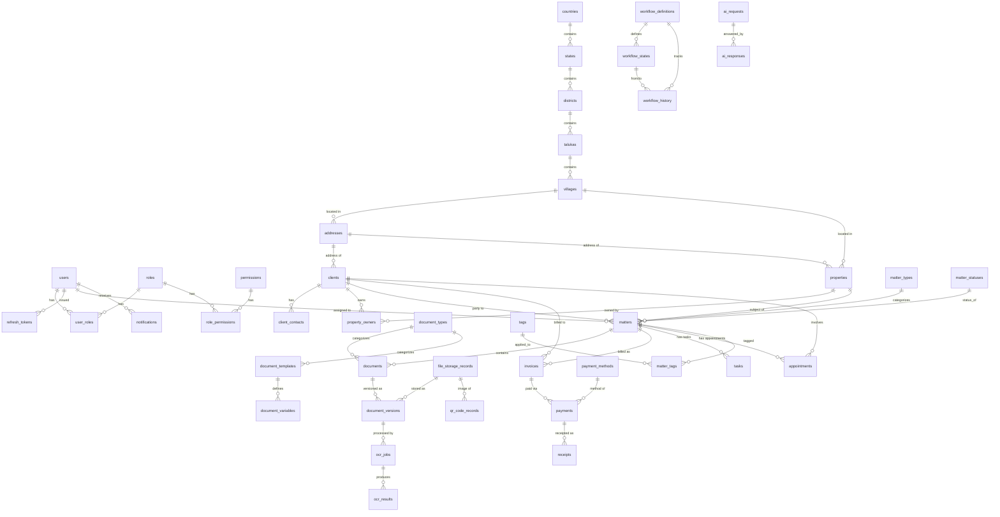

# Entity Relationship Diagram

Stage 2's complete 49-table schema, plus one Stage 3 addition (`refresh_tokens`, `T49` — see
Section 1 below and [Database.md](Database.md) for detail). Most of this schema is a **pure
schema** — no repositories, services, or API routes are wired to it yet (that's explicitly
future-stage work; see [Database.md](Database.md) for the full per-table reference and
[ProjectStatus.md](ProjectStatus.md) for what Stage 2 did and didn't build). `refresh_tokens` is
the first exception in progress — Stage 3's `AuthService` (`T50`, not yet built) is what will
actually read/write it.

## Diagram

Polymorphic cross-cutting tables (`activity_logs`, `audit_logs`, `workflow_history`,
`qr_code_records`, `ai_requests`) reference "any entity" via an `entity_type` + `entity_id` pair
with **no FK constraint** — they have no single target table, so they're omitted from the diagram's
arrows and documented in prose below instead. `application_settings`, `feature_flags`,
`plugin_registry`, `background_jobs`, and `system_events` are standalone system/config tables (at
most an optional FK to `users` for `updated_by`) and are likewise omitted from the diagram to keep
it readable — see the Section 11 table list below.

## Polymorphic references (entity_type + entity_id, no FK)

| Table | `entity_type` examples (not enforced) | Why polymorphic |
|---|---|---|
| `activity_logs` | `matter`, `document`, `client`, ... | A single activity feed spans every entity type; a real FK per possible type isn't feasible. |
| `audit_logs` | any entity | Mirrors `AuditLogger.record()`'s signature (see [ADR/0009](../ADR/0009-audit-logs-table-reverses-adr-0007.md)) — general-purpose audit trail. |
| `workflow_history` | `matter` today, any future workflow-tracked entity | Persisted counterpart to Stage 1's in-memory `WorkflowEngine` — one history table serves every workflow definition. |
| `qr_code_records` | `matter`, `document`, `property`, ... | A QR code can point at any entity the office wants to physically label. |
| `ai_requests` | any entity, or `NULL` for a context-free request | AI features are unbuilt; kept generic rather than guessed at. |

Trade-off accepted explicitly: no DB-level referential integrity on `entity_id` in these five
tables. Standard for this pattern — the alternative (a nullable FK per possible entity type) doesn't
scale as new entity types are added.

## Table list by section

Each section corresponds to one Alembic migration; see [Database.md](Database.md) for full column
detail.

1. **Identity & Access** — `users`, `roles`, `permissions`, `user_roles`, `role_permissions`, plus
   `refresh_tokens` (Stage 3, `T49`, migration `2572cb3570d7` — not part of Stage 2's original 49)
2. **Geography** — `countries`, `states`, `districts`, `talukas`, `villages`
3. **Clients** — `addresses`, `clients`, `client_contacts`
4. **Properties** — `properties`, `property_owners`
5. **Matters & Workflow** — `matter_types`, `matter_statuses`, `matters`, `workflow_definitions`,
   `workflow_states`, `workflow_history`
6. **Documents** — `document_types`, `document_templates`, `document_variables`, `documents`,
   `document_versions` (plus `file_storage_records`, pulled forward from Section 10 — see
   Database.md's Deviations note)
7. **Financial** — `payment_methods`, `invoices`, `payments`, `receipts`
8. **Activity, Audit & Notifications** — `activity_logs`, `audit_logs`, `notifications`
9. **Scheduling & Tags** — `tasks`, `appointments`, `tags`, `matter_tags`
10. **OCR, QR & Backups** — `ocr_jobs`, `ocr_results`, `qr_code_records`, `backups`
    (`file_storage_records` itself lives in Section 6, see above)
11. **System, Config, AI & Plugins** — `application_settings`, `feature_flags`, `ai_requests`,
    `ai_responses`, `plugin_registry`, `background_jobs`, `system_events`

Section 12 is a seed-data-only migration (no new tables) — see Database.md's Seed Data section.

## Index strategy

| Search need (from the charter) | Index |
|---|---|
| Client search | `ix_clients_full_name`, `ix_clients_primary_phone` |
| Matter number search | `uq_matters_matter_number` (unique index doubles as lookup) |
| Survey number search | `ix_properties_survey_number` |
| Village search | `ix_properties_village_id`, `ix_addresses_village_id` |
| Registration number | `ix_properties_registration_number` |
| Mobile number | `ix_clients_primary_phone`, `ix_client_contacts_phone` |
| Document lookup | `ix_documents_matter_id`, `ix_document_versions_document_id` |
| OCR lookup | `ix_ocr_jobs_document_version_id`, `ix_ocr_results_ocr_job_id` |
| Full-text search prep | GIN expression index on `to_tsvector('english', ocr_results.extracted_text)` — confirmed working against live Postgres in [test_ocr_qr_backup_models.py](../backend/tests/integration/test_ocr_qr_backup_models.py) |

Composite indexes: `(entity_type, entity_id)` on every polymorphic table (`activity_logs`,
`audit_logs`, `workflow_history`, `qr_code_records`); `(recipient_id, is_read)` on `notifications`.

## Naming conventions

Enforced automatically for every table via `Base.metadata`'s `naming_convention` (set once in
[`infrastructure/database/base.py`](../backend/src/app/infrastructure/database/base.py)), not
hand-applied per table:

| Kind | Pattern | Example |
|---|---|---|
| Primary key | `pk_<table>` | `pk_matters` |
| Foreign key | `fk_<table>_<column>_<referenced_table>` | `fk_matters_client_id_clients` |
| Unique constraint | `uq_<table>_<column>` | `uq_matters_matter_number` |
| Index | `ix_<table>_<column>` | `ix_clients_primary_phone` |
| Check constraint | `ck_<table>_<name>` | `ck_matters_closed_at_after_opened_at` |

See [Database.md](Database.md) for the double-prefix pitfall this convention has when a
`CheckConstraint`'s own `name=` argument is given the *full* name instead of a short logical one.
